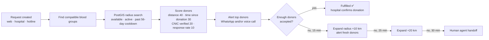
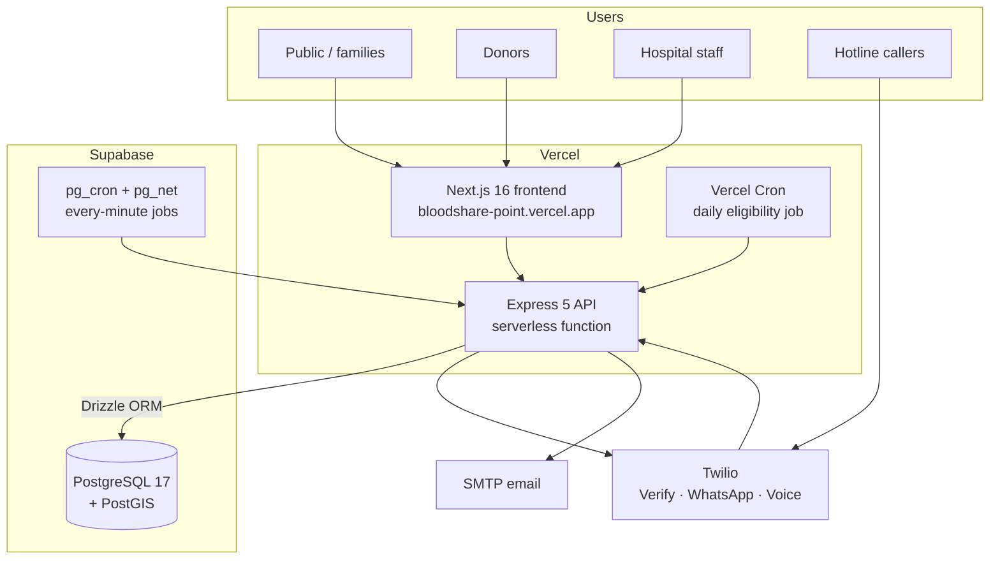

# 🩸 BloodShare Point

### Our Point of Connection for Saving Lives

**An emergency blood-matching platform for Pakistan.** A family or hospital submits a request, and BloodShare Point finds compatible, eligible donors nearby and alerts them over WhatsApp and voice calls within seconds.

---

## 🔗 Live Links

| | URL |
|---|---|
| **Web app** | https://bloodshare-point.vercel.app |
| **Backend API** | https://bloodshare-point-backend.vercel.app |
| **API health check** | https://bloodshare-point-backend.vercel.app/health |

> [!NOTE]
> **The live site runs in demo mode.** No real SMS, WhatsApp messages or phone calls are sent, and donor login accepts **any 6-digit code**. Please don't enter real personal data. Demo mode is switched off once real Twilio credentials are configured.

---

> [!IMPORTANT]
> **This is the public project overview.** The source code lives in a private repository. Try the live app with the links above.

---

## ❗ The Problem

In an emergency, families in Pakistan often search for blood donors through phone calls, social media posts and word of mouth, which can take hours. Hospitals face the same problem for rare blood groups. Many willing donors are nearby, but there's no fast way to reach the *right* ones: compatible blood group, close enough, and actually eligible to donate.

**BloodShare Point closes that gap.** A request goes in through the website, a hospital dashboard or a phone hotline. The matching engine ranks nearby eligible donors and alerts the best ones immediately, then widens the search automatically if no one responds.

---

## ✨ Features

### 🧑‍🤝‍🧑 For the public (no account needed)
- **Emergency request form**: blood group, units, urgency and location (auto-detected with GPS).
- **Live tracking page**: status, donors alerted, donors confirmed and fulfilment progress. No donor personal data is ever shown.
- **Phone hotline (IVR)**: callers without internet can request blood by keypad in Urdu.

### 🩸 For donors
- **Registration with WhatsApp OTP**: no passwords to remember.
- **Nearby requests feed**: only requests the donor's blood group can help, sorted by urgency then distance.
- **One-tap accept or decline**, or press **1 / 2** on an automated phone call.
- **Profile**: availability toggle, CNIC verification (stored hashed, never in plain text), donation history, next eligible date.
- **Badges**: First Drop (1), Life Saver (3), Guardian (5), Hero (10), Verified Hero (CNIC + 5).

### 🏥 For hospitals
- **Vetted onboarding**: hospitals apply, and the BloodShare Point team approves or rejects with a one-click email link. The account and a temporary password are created automatically.
- **Dashboard**: live KPIs (active requests, fulfilled today, average fulfilment time, donors alerted) and the list of donors who accepted each request.
- **Create requests** that use the hospital's saved location, with a **priority boost** (+20% radius and donors).
- **Confirm donations**: only a hospital's confirmation records a donation, updates the donor's history and badges, and starts their 56-day cooldown.
- **Request history** with filters and pagination, plus **30-day analytics** (demand by blood group, fulfilment-rate trend, response-time trend, donor no-show rate).

---

## 🧠 How Matching Works

| Urgency | Search radius | Donors alerted | Channel |
|---|---|---|---|
| Routine | 10 km | top 20 | WhatsApp |
| Urgent | 20 km | top 30 | WhatsApp + voice call |
| Critical | 30 km | top 50 | Voice call first, then WhatsApp |

Hospital requests get **+20%** radius and donors alerted.

**Blood compatibility** follows standard red-cell rules (for example O− can give to everyone, and AB+ can receive from everyone). **Eligibility**: a donor is skipped for **56 days** after a confirmed donation, and gets a WhatsApp reminder when they're eligible again.

**Accept vs. donate:** accepting a request only records *intent*. A donation is recorded when the hospital confirms it, which keeps history, badges and cooldowns accurate.

---

## 🏗 Architecture

- The **frontend** is a Next.js app that talks to the API over HTTPS with JWTs. Donor sessions refresh automatically.
- The **backend** is an Express app deployed as a single Vercel serverless function. Work that runs after a response (matching, notifications) is kept alive with Vercel's `waitUntil`.
- The **database** is Supabase Postgres with PostGIS for geographic radius search. All access goes through **Drizzle ORM**, and Row Level Security blocks Supabase's public REST API from the tables.
- **Scheduled jobs**: Vercel's free plan only allows daily crons, so the every-minute radius-expansion job is triggered by **Supabase pg_cron**. The shared secret for it is stored in Supabase Vault.

---

## 🧰 Tech Stack

| Layer | Technology |
|---|---|
| **Frontend** | Next.js 16 (App Router), React 19, TypeScript, Tailwind CSS 4, Zustand, Axios, react-hot-toast, lucide-react |
| **Backend** | Node.js 22, Express 5, **Drizzle ORM**, **Zod 4** validation, postgres.js |
| **Database** | Supabase PostgreSQL 17 + PostGIS 3 (geography points, GiST indexes) |
| **Auth** | JWT: donor access (15 min) + rotating refresh tokens (7 days), separate hospital tokens; bcrypt for passwords |
| **Messaging** | Twilio Verify (WhatsApp OTP), WhatsApp Business API, Programmable Voice + IVR; Nodemailer (SMTP) |
| **Security** | Helmet, CORS allow-list, express-rate-limit, HPP, Zod input whitelisting, Row Level Security |
| **Jobs** | node-cron (local), Vercel Cron + Supabase pg_cron / pg_net (production) |
| **Hosting** | Vercel (frontend + backend), Supabase (database) |

---

## 🛡 Security

- **Input validation**: every body, query and URL parameter is parsed by **Zod**. Values are trimmed and coerced, and unknown fields are dropped before reaching business logic.
- **SQL safety**: all queries go through Drizzle ORM with bound parameters, including the PostGIS expressions.
- **Row Level Security** is on for every table, so Supabase's auto-generated REST API can't read donor data.
- **Auth**: short-lived access tokens. Refresh tokens rotate on every use and are stored as SHA-256 hashes, so an old or stolen token stops working. Hospital passwords and CNICs use bcrypt.
- **Rate limits**: general API, OTP (per phone), login (per IP) and hospital login (per email).
- **Phone-enumeration safe** donor login.
- **Helmet** security headers, a **CORS allow-list** and **HPP** protection.
- **Twilio webhook signature** validation in production.
- **Data integrity**: atomic unit counting (no double counting when donors accept at the same moment), idempotent donation confirmation, and transactional hospital approval.
- **Demo-mode guard**: test Twilio keys can't be used in production unless `DEMO_MODE=true` is set explicitly.

---

## 🗺 Roadmap

- [ ] Real Twilio + SMTP credentials (switch off demo mode)
- [ ] Admin panel for the BloodShare Point team (hospitals, donors, handoffs)
- [ ] Real-time dashboard updates (Supabase Realtime)
- [ ] Google Places search for hospital locations
- [ ] SMS fallback for donors without WhatsApp
- [ ] Blood bank inventory management
- [ ] Multi-city expansion beyond Karachi
- [ ] Mobile app (React Native)

---

Built with ❤️ by **[Nousheen Adeel](https://github.com/Nousheen-Adeel)** to help save lives, one match at a time.

© 2026 BloodShare Point. All rights reserved.

